# Diagramas do Sistema de Biblioteca

## Diagrama de Casos de Uso

```mermaid
graph TD
    %% Atores
    UC[👤 Usuário Comum]
    AD[👨‍💼 Administrador]
    SY[🖥️ Sistema]
    
    %% Casos de Uso Principais
    subgraph "Sistema de Biblioteca"
        UC01[UC01: Fazer Login]
        UC02[UC02: Listar Livros]
        UC03[UC03: Emprestar Livro]
        UC04[UC04: Visualizar Status]
        UC05[UC05: Fazer Logout]
        
        %% Casos de Uso Administrativos
        UC06[UC06: Adicionar Livro]
        UC07[UC07: Gerenciar Catálogo]
        UC08[UC08: Processar Devolução]
        UC09[UC09: Visualizar Logs]
        UC10[UC10: Empréstimos Ativos]
        UC11[UC11: Gerar Relatórios]
        
        %% Casos de Uso do Sistema
        UC12[UC12: Validar Credenciais]
        UC13[UC13: Controlar Acesso]
        UC14[UC14: Registrar Empréstimo]
        UC15[UC15: Atualizar Status]
    end
    
    %% Relacionamentos Usuário Comum
    UC --> UC01
    UC --> UC02
    UC --> UC03
    UC --> UC04
    UC --> UC05
    
    %% Relacionamentos Administrador
    AD --> UC01
    AD --> UC02
    AD --> UC06
    AD --> UC07
    AD --> UC08
    AD --> UC09
    AD --> UC10
    AD --> UC11
    AD --> UC05
    
    %% Includes
    UC01 -.-> UC12
    UC01 -.-> UC13
    UC03 -.-> UC14
    UC03 -.-> UC15
    UC08 -.-> UC15
    
    %% Extends
    UC02 -.-> UC04
    UC09 -.-> UC11
    
    %% Herança
    AD -.-> UC

    classDef userCase fill:#e1f5fe,stroke:#0277bd,stroke-width:2px
    classDef adminCase fill:#fff3e0,stroke:#f57c00,stroke-width:2px
    classDef systemCase fill:#e8f5e8,stroke:#2e7d32,stroke-width:2px
    classDef actor fill:#ffcdd2,stroke:#d32f2f,stroke-width:2px
    
    class UC01,UC02,UC03,UC04,UC05 userCase
    class UC06,UC07,UC08,UC09,UC10,UC11 adminCase
    class UC12,UC13,UC14,UC15 systemCase
    class UC,AD,SY actor
```

## Diagrama de Classes

## Detalhamento dos Casos de Uso

### UC01: Fazer Login
- **Ator**: Usuário Comum, Administrador
- **Pré-condições**: Sistema disponível
- **Fluxo Principal**: 
  1. Usuário acessa a tela de login
  2. Insere credenciais (nome e senha)
  3. Sistema valida credenciais
  4. Sistema identifica tipo de usuário
  5. Sistema exibe interface apropriada
- **Pós-condições**: Usuário autenticado no sistema

### UC03: Emprestar Livro
- **Ator**: Usuário Comum, Administrador
- **Pré-condições**: Usuário logado, livro disponível
- **Fluxo Principal**:
  1. Usuário seleciona livro para empréstimo
  2. Sistema verifica disponibilidade
  3. Sistema registra empréstimo
  4. Sistema atualiza status do livro
  5. Sistema confirma operação
- **Pós-condições**: Livro emprestado, registro criado

### UC06: Adicionar Livro
- **Ator**: Administrador
- **Pré-condições**: Usuário com privilégios de admin
- **Fluxo Principal**:
  1. Admin acessa painel administrativo
  2. Seleciona opção "Adicionar Livro"
  3. Insere dados do livro (título obrigatório)
  4. Sistema valida dados
  5. Sistema adiciona livro ao catálogo
- **Pós-condições**: Novo livro disponível no sistema

## Arquitetura do Sistema

O sistema segue o padrão **MVC (Model-View-Controller)** com separação clara de responsabilidades:

- **Model**: Classes `Usuario`, `Livro`, `Emprestimo`
- **View**: `WebInterface`, `APIEndpoints`
- **Controller**: `BibliotecaController`, `AdminController`, `AuthController`

### Características Arquiteturais:
- ✅ **Separação de Responsabilidades**
- ✅ **Baixo Acoplamento**
- ✅ **Alta Coesão**
- ✅ **Reutilização de Código**
- ✅ **Facilidade de Manutenção**
- ✅ **Testabilidade**
